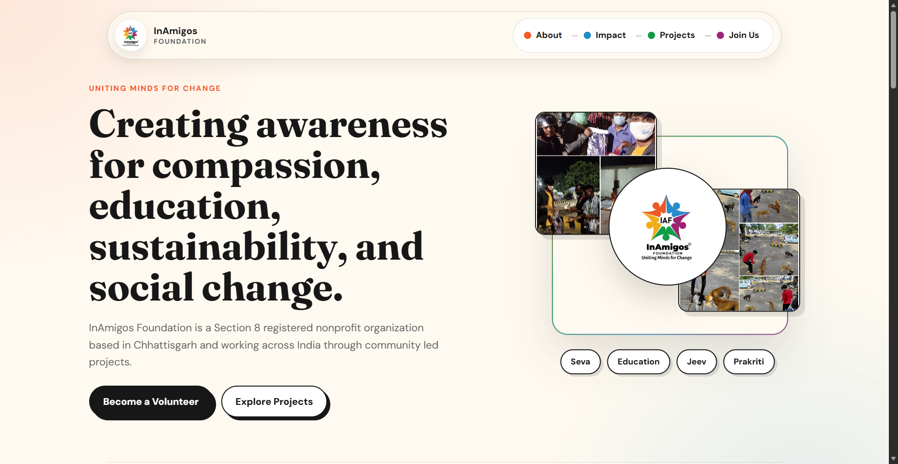
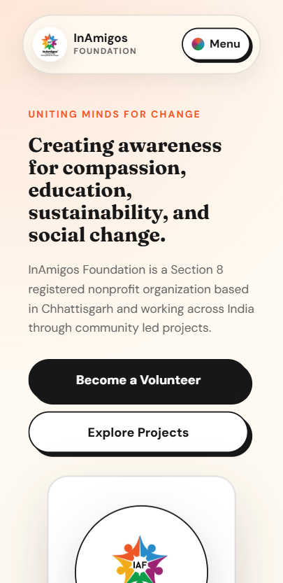

# Task 1: NGO Awareness Webpage

This task is a basic awareness webpage for InAmigos Foundation. It introduces the NGO, highlights ongoing projects, explains social impact, and gives visitors clear calls to action.

## Screenshots

### Desktop View



### Mobile View



## What It Includes

- NGO introduction
- Ongoing project details
- Social impact and purpose
- Official visuals and logo
- Call-to-action buttons for volunteering and following updates
- Official website and social media links
- Source links in the footer

## Files

```txt
Task-1/
├── assets/
│   ├── logo.jpg
│   ├── project-jeev.jpg
│   ├── project-seva.jpg
│   └── water-day.jpg
├── desktop-ss.png
├── index.html
├── mobile-ss.png
├── README.md
└── style.css
```

## Preview

Open `index.html` directly, or run a local server from the repository root:

```bash
python -m http.server 5500
```

Then visit:

```txt
http://127.0.0.1:5500/Task-1/
```

## Sources Used

- InAmigos official website and gallery
- Official LinkedIn page
- Official social media links shared for the internship task

## GitHub Pages Compatibility

- Uses relative paths only
- No build step required
- No framework or package install required
- Works as `/Task-1/` when deployed from the repository root.
