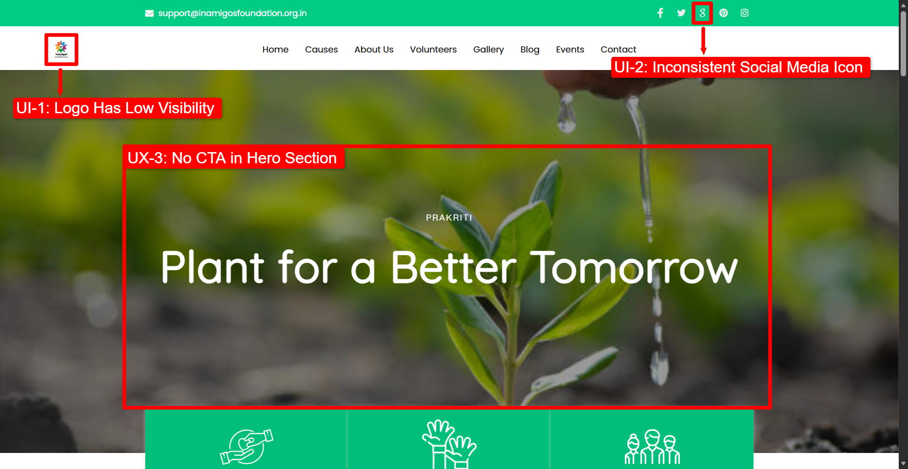
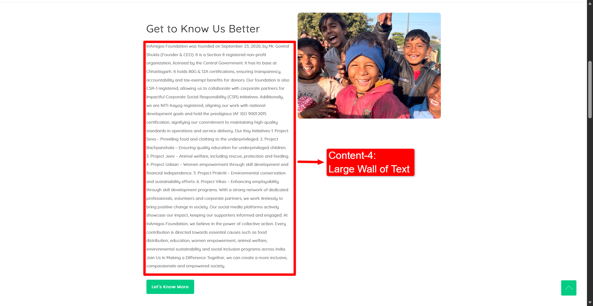
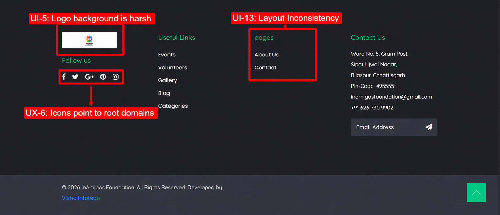
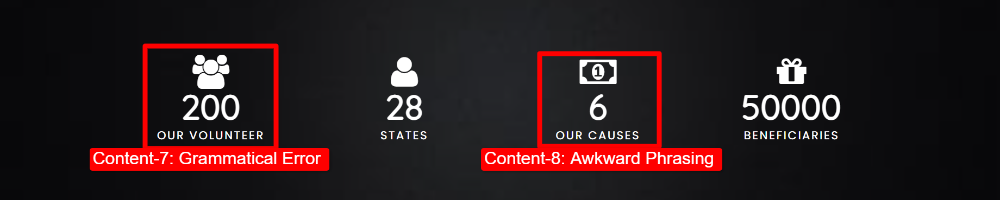
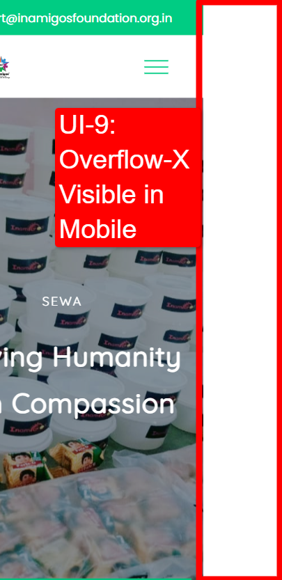
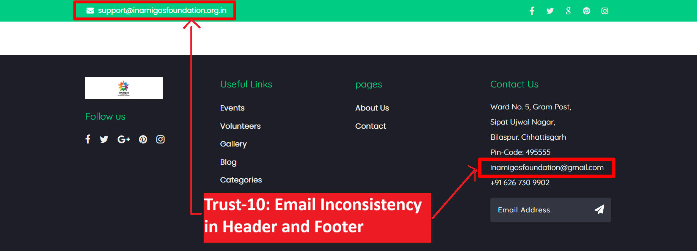
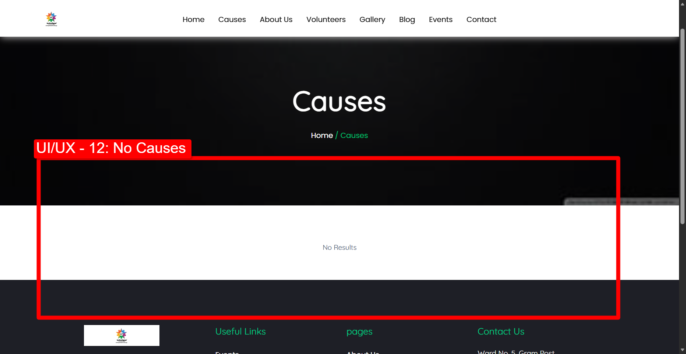

# WEBSITE IMPROVEMENT ANALYSIS REPORT
**Client:** InAmigos Foundation  
**Audit Scope:** UX/UI, Typography, Mobile Responsiveness, Accessibility, Content Quality, SEO, & Performance  
**Date:** June 12, 2026  
**Prepared by:** Vaibhav Patel  
**Role:** Web Development Intern  

---

## 1. Executive Summary

This report provides a revised comprehensive evaluation of the InAmigos Foundation website (https://inamigosfoundation.org.in/). The objective of this audit is to identify visual, technical, and structural issues that hinder user experience, reduce donor trust, and lower donation conversion rates.

Based on updated visual evidence and design specifications, the website has been audited across fifteen (15) core areas. This includes major usability bugs such as mobile horizontal viewport overflow, unpopulated primary campaign routes, unpolished footer elements, content grammatical errors, and outdated branding components.

Addressing these findings in a timely manner will modernize the foundation's web presence, optimize mobile readability, and establish the visual trust required to support donation and volunteer acquisition.

---

## 2. Summary of Findings

| ID | Category | Section | Priority | Visual Reference | Summary Description |
| :--- | :--- | :--- | :--- | :--- | :--- |
| **01** | UI / Design | Header | Medium | Header & Hero | Navbar logo has low visibility and the brand name is unreadable. |
| **02** | UI / Design | Header | Low | Header & Hero | Deprecated Google Plus (G+) social media icon is displayed in the header. |
| **03** | UX | Hero Slider | High | Header & Hero | Absence of a primary Call-to-Action (CTA) button in the Hero slider. |
| **04** | Content | About Us | Medium | About Us | Large "wall of text" in the About Us section reduces readability. |
| **05** | UI / Design | Footer | Low | Footer | InAmigos logo container in the dark footer has a harsh white background box. |
| **06** | UX | Footer | Medium | Footer | Social media icons in the footer point to root domains instead of profiles. |
| **07** | Content | Achievements | Low | Achievements | Grammatical error "200 OUR VOLUNTEER" (should be plural). |
| **08** | Content | Achievements | Low | Achievements | Inconsistent and awkward phrasing "6 OUR CAUSES". |
| **09** | Mobile / UI | Layout | High | Mobile Overflow | Horizontal overflow-x is visible on mobile devices, causing page shifting. |
| **10** | Trust | Header/Footer | High | Header & Footer | Email inconsistency (domain email in header vs. generic Gmail in footer). |
| **11** | Trust | Team | High | N/A | Placeholder/invalid email addresses displayed under volunteer profiles. |
| **12** | UI / UX | Causes | High | No Causes | Causes page displays "No Results" and contains no active campaigns. |
| **13** | UI / Design | Footer | Low | Footer | Column heading "pages" is written in lowercase, violating visual consistency. |
| **14** | SEO | Code | High | N/A | Eleven `<h1>` tags on the homepage, diluting search engine indexing. |
| **15** | Performance | Asset | Medium | N/A | Large hero slider illustrations loaded as CSS background-images. |

---

## 3. Detailed Audit Observations

### Observation #1: Navbar Logo Has Low Visibility

* **Issue:** The brand logo inside the main header navbar is extremely small (approximately 50px wide) and the text "InAmigos" printed below the icon is completely unreadable.
* **Why It Is A Problem:** Brand identity is the foundation of visitor trust, particularly for non-profit organizations. When a logo is scaled down to a point where the name is unreadable, it weakens brand recall and lowers professional credibility.
* **Recommended Improvement:** Increase the navbar logo height/width to a minimum of 100px-120px. Use a horizontal layout lockup where the circular icon is positioned on the left and "InAmigos Foundation" is typed in clear, bold typography on the right with a transparent background.
* **Expected Benefit:** Immediate brand identification and a clean, professional navbar layout.
* **Priority:** Medium
* **Category:** UI / Design

---

### Observation #2: Outdated Google Plus (G+) Icon in Header

* **Issue:** The top header social link bar contains a Google Plus ("G+") icon. Google Plus was permanently shut down for consumer accounts in April 2019.
* **Why It Is A Problem:** Presenting dead platforms indicates that the website is unmaintained and neglected, eroding user trust in the organization's current operations.
* **Recommended Improvement:** Remove the Google Plus icon and replace it with an active channel, such as LinkedIn or YouTube, or remove it entirely to clean up the bar.
* **Expected Benefit:** A clean, relevant, and modern social media links bar.
* **Priority:** Low
* **Category:** UI / Design

---

### Observation #3: Absence of Call-to-Action (CTA) in Hero Section

* **Issue:** The homepage hero slider displays promotional headings ("Plant for a Better Tomorrow") but does not feature any interactive buttons or Call-to-Action (CTA) links.
* **Why It Is A Problem:** The hero section is the first element visitors see. Leaving it without a clear action button results in missed opportunities for donation and volunteer recruitment, as users must manually search the menu to find where to take action.
* **Recommended Improvement:** Add a set of action buttons centered below the subtext:
  1. A primary solid button: "Donate Now" (using the brand green accent color).
  2. A secondary outlined button: "Become a Volunteer" or "Join Us" (white border and text).
* **Expected Benefit:** May improve donation page click-through rates and volunteer signups.
* **Priority:** High
* **Category:** UX

---

### Observation #4: Large Wall of Text in About Us Section

* **Issue:** The main introductory section of "Get to Know Us Better" displays a large, single paragraph of dense text without any breaks, bullet points, or visual hierarchy.
* **Why It Is A Problem:** Densely packed paragraphs create high cognitive load, causing most visitors to skip reading. Crucial details that establish the NGO's legitimacy (80G & 12A certifications, NITI Aayog registration, ISO 9001:2015 registration, and CSR-1 registration) are buried and easily missed.
* **Recommended Improvement:** Split the text into two shorter, readable paragraphs. Highlight key registrations (NITI Aayog, ISO, CSR-1, 80G/12A) by displaying them as a row of visual checkmark badges or grid cards below the text.
* **Expected Benefit:** Enhanced readability and immediate communication of the foundation's legal credentials.
* **Priority:** Medium
* **Category:** Content

---

### Observation #5: White Background Logo Container in Footer

* **Issue:** The InAmigos logo in the dark footer is displayed inside a solid white rectangle container.
* **Why It Is A Problem:** The white box creates a harsh visual border that clashes with the dark footer background, making the implementation look unpolished and visually jarring.
* **Recommended Improvement:** Use a transparent PNG logo. If the text in the logo is too dark, utilize an inverted (solid white) version of the logo assets for dark background elements.
* **Expected Benefit:** A clean, integrated, and professional footer design.
* **Priority:** Low
* **Category:** UI / Design

---

### Observation #6: Footer Social Icons Point to Root Domains

* **Issue:** The social media icons in the footer (Facebook, Twitter, G+, etc.) link to generic homepages (e.g., `https://twitter.com/`) rather than the foundation's specific profiles.
* **Why It Is A Problem:** Users attempting to connect with the organization on social media are sent to generic root landing pages, leading to lost social engagement and confusion.
* **Recommended Improvement:** Update the HTML anchor `href` attributes to point directly to the foundation's verified social media handles (e.g., `https://instagram.com/inamigos_foundation`).
* **Expected Benefit:** Increased social media followers and better user engagement.
* **Priority:** Medium
* **Category:** UX

---

### Observation #7: Grammatical Error in Volunteer Count

* **Issue:** The counters section displays "200 OUR VOLUNTEER" instead of "200 OUR VOLUNTEERS".
* **Why It Is A Problem:** Typographical and grammatical errors on main landing pages reduce professional authority. Donors want to ensure their funds are managed by detail-oriented organizations.
* **Recommended Improvement:** Correct the text label to use the plural form: "OUR VOLUNTEERS".
* **Expected Benefit:** Grammatically correct, polished copy on the homepage.
* **Priority:** Low
* **Category:** Content

---

### Observation #8: Awkward Phrasing in Causes Count

* **Issue:** The counter displaying active campaigns reads "6 OUR CAUSES".
* **Why It Is A Problem:** The phrasing is syntactically awkward and is inconsistent with the phrasing of neighboring metrics (e.g. "28 STATES", "50000 BENEFICIARIES").
* **Recommended Improvement:** Change the label to "SUPPORTED CAUSES" or "ACTIVE CAUSES" to align with other achievements.
* **Expected Benefit:** Unified visual and grammatical structure across the counter cards.
* **Priority:** Low
* **Category:** Content

---

### Observation #9: Horizontal Viewport Overflow on Mobile Devices

* **Issue:** On mobile viewport sizes, the webpage suffers from horizontal overflow-x, creating an empty white vertical strip on the right side of the screen.
* **Why It Is A Problem:** This layout breakage causes the page to slide horizontally when the user scrolls vertically. It indicates a lack of mobile responsive design testing and makes reading the website frustrating.
* **Recommended Improvement:** Identify the wide elements exceeding the viewport (likely unconstrained headers, layout grids, or absolute elements) and set their CSS width to `max-width: 100%`. Alternatively, ensure `overflow-x: hidden` is applied to the main HTML/Body wrapper.
* **Expected Benefit:** A stable, smooth, and optimized vertical scroll experience on all mobile screens.
* **Priority:** High
* **Category:** Mobile / UI

---

### Observation #10: Email Inconsistency in Header and Footer

* **Issue:** The header of the website displays a professional domain email address (`support@inamigosfoundation.org.in`), whereas the footer lists a free Gmail address (`inamigosfoundation@gmail.com`).
* **Why It Is A Problem:** Inconsistent contact information is confusing and looks unprofessional. Using a free Gmail address on a live site suggests the organization lacks domain security or official administration, reducing visitor trust.
* **Recommended Improvement:** Standardize all contact listings on the official website domain email address, such as `info@inamigosfoundation.org.in` or `support@inamigosfoundation.org.in`.
* **Expected Benefit:** Visual and brand consistency, increasing institutional trust.
* **Priority:** High
* **Category:** Trust & Credibility

---

### Observation #11: Placeholder / Invalid Volunteer Email Data

* **Issue:** Volunteer profile cards on the team page contain obviously fake or dummy email addresses (such as `jhfgjufv@gmail.com` under the profile for volunteer Akash).
* **Why It Is A Problem:** Displaying raw, gibberish placeholder data on a live website makes the platform feel like a draft or mock-up. It indicates a lack of quality control and degrades credibility.
* **Recommended Improvement:** Replace all placeholders with genuine, active email addresses, or remove the email address fields from public team cards to protect volunteer privacy.
* **Expected Result:** Removal of raw developer placeholders, improving site legitimacy.
* **Priority:** High
* **Category:** Trust & Credibility

---

### Observation #12: Empty "Causes" Section and Empty Causes Route

* **Issue:** The `/causes` route of the website contains zero campaigns, rendering only a blank screen with a "No Results" label.
* **Why It Is A Problem:** The primary purpose of a foundation website is to showcase the causes they support to encourage donations. An empty causes page prevents visitors from donating or understanding the organization's work.
* **Recommended Improvement:** Populate the causes database. Create interactive campaign cards showing a thumbnail, details, target funds, current progress (percentage funded), and a "Donate" button.
* **Expected Benefit:** Active, transparent presentation of NGO efforts, directly supporting donation conversion.
* **Priority:** High
* **Category:** UI / UX

---

### Observation #13: Case Inconsistency in Footer Header

* **Issue:** In the footer column headings, the navigation link title is written in lowercase ("pages"), while neighboring columns use Title Case ("Useful Links" and "Contact Us").
* **Why It Is A Problem:** Visual and typographic inconsistencies make the website look unpolished and degrade the quality of the layout.
* **Recommended Improvement:** Capitalize the header to "Pages" or change it to "Quick Links" to match the formatting of the other headers.
* **Expected Benefit:** Typographical consistency across the footer.
* **Priority:** Low
* **Category:** UI / Design

---

### Observation #14: Multiple H1 Tags on Homepage

* **Issue:** The landing page HTML contains eleven (11) different `<h1>` tags, with each slide title in the Hero carousel enclosed in its own `<h1>` element.
* **Why It Is A Problem:** Multiple H1 tags can make the page structure unclear for search engines and screen readers. Web crawlers rely on a single, unique `<h1>` element to index the page's main theme. Multiple `<h1>` tags dilute the page's keyword value, decreasing organic search rankings.
* **Recommended Improvement:** Use exactly one `<h1>` tag for the main brand title (e.g. "InAmigos Foundation"). Demote the subheadings in the hero slider and other sections to `<h2>` or `<h3>` elements.
* **Expected Benefit:** Improved SEO ranking scores and better screen reader compatibility.
* **Priority:** High
* **Category:** SEO

---

### Observation #15: CSS Background Images for Main Illustrations

* **Issue:** Large, high-resolution visuals (such as the main hero slider backgrounds) are rendered as CSS `background-image` properties instead of standard HTML image tags.
* **Why It Is A Problem:** Browsers cannot apply lazy-loading attributes (`loading="lazy"`) or responsive dimensions (`srcset`) to CSS background elements, causing slower page load times. They are also invisible to search engine crawlers and screen readers due to a lack of `alt` attributes.
* **Recommended Improvement:** Convert the background wrappers into HTML `` or `<picture>` elements. Load the main hero image normally or with high priority. Lazy-load only images below the fold. Add appropriate `alt` descriptions, and style them using `object-fit: cover` to maintain layout alignment.
* **Expected Benefit:** Faster page load speeds and improved image search indexing.
* **Priority:** Medium
* **Category:** Performance

---

## 4. Technical Recommendations

### SEO Guidelines:
1. **Title Tag Optimization:** Change the current title tag to a descriptive title: `InAmigos Foundation | Official NGO Site | Empowering Communities`.
2. **Metadata Improvements:** Add missing keywords (`NGO child education`, `InAmigos Foundation`, `CSR donation India`, `animal welfare NGO`) and fix spelling typos in the meta description (`...foods and water...` to `...food and water...`).

### Performance Guidelines:
1. **Image Compression:** Convert all large homepage images to next-gen WebP formats which can reduce file size and bandwidth usage.
2. **Caching Headers:** Configure the web hosting server to serve static assets (such as logos and icons) with long-term cache headers.

---

## 5. Actionable Roadmap

The following table outlines the phased schedule for implementing the recommendations:

| Phase | Task Name | Timeframe | Priority |
| :--- | :--- | :--- | :--- |
| **Phase 1** | Mobile Viewport Shift Fix (Overflow-X) | Immediate | High |
| **Phase 1** | Standardize Brand Contact Emails | Immediate | High |
| **Phase 1** | Populate Causes Database / Route | Immediate | High |
| **Phase 1** | Fix Volunteer Placeholder Emails | Immediate | High |
| **Phase 1** | Demote Homepage H1 Tags for SEO | Immediate | High |
| **Phase 2** | Add Hero Slider CTA Buttons | Short-term | Medium |
| **Phase 2** | Re-layout About text into visual cards | Short-term | Medium |
| **Phase 2** | Increase Header Logo Size & Visibility | Short-term | Medium |
| **Phase 2** | Optimize CSS background images to HTML | Short-term | Medium |
| **Phase 3** | Remove Google Plus Icon / Add Active Socials | Medium-term | Low |
| **Phase 3** | Replace Footer Logo white bg with transparency | Medium-term | Low |
| **Phase 3** | Fix Footer Casing Inconsistencies | Medium-term | Low |
